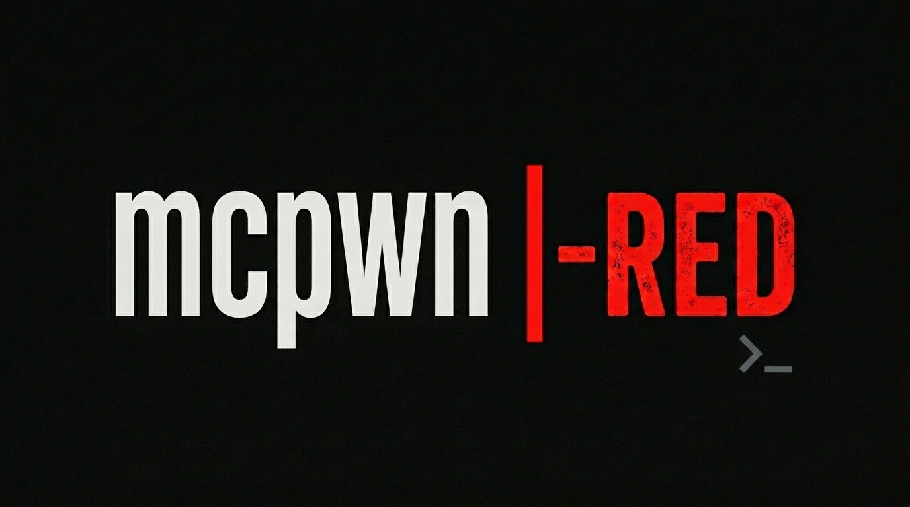

# mcpwn-red 🛡️

**Adversarial safety harness for the MCPwn AI pentesting execution engine.**

[](https://github.com/Mutasem-mk4/mcpwn-red/actions/workflows/ci.yml)
[](LICENSE)
[](pyproject.toml)
[](https://gitlab.com/parrotsec/project/community/-/work_items/62)

`mcpwn-red` is a pre-engagement safety validator designed for security professionals using MCPwn. It allows operators to verify the integrity and isolation of their AI-assisted execution environment *before* trusting it in a production engagement.

---

## ⚡ Quick Start

```bash
# Install from source
pip install .

# Probe reachability
mcpwn-red probe --transport stdio

# Run full safety scan
mcpwn-red scan --all --transport stdio --confirm-write
```

---

## 🔍 Why mcpwn-red?

As AI-driven pentesting engines like MCPwn become standard in security workflows, the "trusted execution layer" becomes a high-value target. A compromised MCPwn instance can lead to:
*   **Operator Subversion:** Hostile targets injecting malicious tool definitions.
*   **Data Leakage:** Prompt injection exfiltrating sensitive engagement data.
*   **Host Compromise:** Container escapes via unsafe tool configurations.

`mcpwn-red` provides the necessary "Shift-Left" security checks to ensure your tools are as secure as the targets you are testing.

### Key Validation Modules:
*   **YAML Injection Tester:** Probes for tool-definition poisoning and metadata subversion.
*   **Output Injection Simulator:** Tests for exfiltration and instruction smuggling through tool outputs.
*   **Container Boundary Checker:** Verifies Docker/Host isolation and environment variable protection.
*   **Tool Scope Escalation:** Confirms that logical boundaries between tool categories are enforced.

---

## 🛠️ Features

- **Protocol Native:** Built on the official `mcp>=1.0` SDK.
- **Visual Reports:** Professional terminal tables, Markdown, and HTML report generation.
- **Safety First:** Destructive write tests are gated behind `--confirm-write`.
- **Distro Ready:** Fully compatible with Parrot OS and Debian packaging standards.

---

## 📦 Distro Integration (Parrot OS)

`mcpwn-red` is designed to be a first-class citizen in the Parrot OS ecosystem.
- **Manpages:** Full documentation available via `man mcpwn-red`.
- **Metadata:** Compliant with `lintian` and `autopkgtest` standards.
- **Binary Package:** Available as a `.deb` for seamless integration.

---

## 🤝 Contributing

We welcome contributions! Please see our [CONTRIBUTING.md](CONTRIBUTING.md) for details. 
We have active templates for:
- [Bug Reports](.github/ISSUE_TEMPLATE/bug_report.yml)
- [Feature Requests](.github/ISSUE_TEMPLATE/feature_request.yml)

---

## ⚖️ Legal & Ethical Use

Use `mcpwn-red` only against MCPwn deployments you are authorized to assess. The tool prints a mandatory ethical-use notice on every invocation to remind operators of their responsibilities.

---

## 📝 License

Distributed under the **GPL-3.0-only** License. See `LICENSE` for more information.
