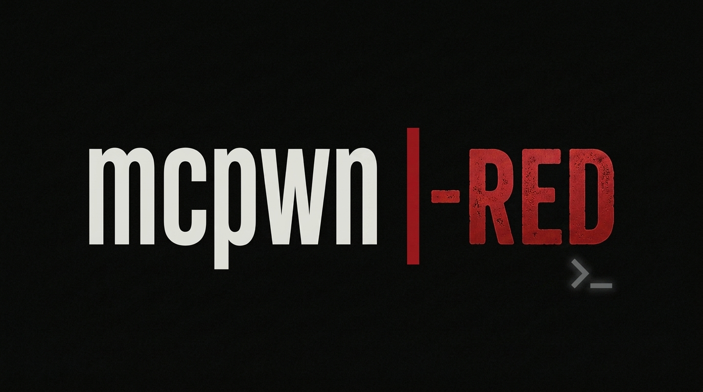

# mcpwn-red 🛡️

**Adversarial safety harness for the MCPwn AI pentesting execution engine.**

[](https://github.com/Mutasem-mk4/mcpwn-red/actions/workflows/ci.yml)
[](LICENSE)
[](pyproject.toml)
[](https://gitlab.com/parrotsec/project/community/-/work_items/62)

`mcpwn-red` is a pre-engagement safety validator designed for security professionals using MCPwn. It reports evidence from configured checks; a passing check does not establish the safety of an entire deployment.

---

## ⚡ Quick Start

```bash
# Install from source
git clone https://github.com/Mutasem-mk4/mcpwn-red.git
cd mcpwn-red
python3 -m venv .venv
. .venv/bin/activate
pip install .

# Probe reachability
mcpwn-red probe --transport stdio

# Run deployment checks (YAML launches temporary MCPwn instances)
mcpwn-red scan --all --transport stdio --confirm-write
```

Install and configure [MCPwn](https://gitlab.com/parrotsec/project/mcpwn) first, and make its `mcpwn` executable available on `PATH` for the stdio probe. Installing `mcpwn-red` does not install MCPwn. If the executable is elsewhere, `scan` accepts `--mcpwn-command /path/to/mcpwn`; `probe` uses `mcpwn` from `PATH`. On Debian/Ubuntu, install `python3-venv` if creating the environment fails.

---

## 🔍 Why mcpwn-red?

MCPwn accepts operator-defined tools. This project probes registration behavior and inspects tool metadata for risky configuration patterns; its output needs an explicit operator policy and review.

A registered shell command or a tool available through MCP is not, by itself, evidence of unauthorized access, a container escape, or successful prompt injection. Local output tests are simulations, not tests of a deployed language model's behavior.

### Assessment Modules

* **YAML:** Submits fixture tool definitions and records registration or rejection.
* **Output:** Simulates propagation of hostile output through a local mock client.
* **Container:** Inspects available tool metadata for container-related risk patterns.
* **Scope:** Inspects tool availability and metadata for scope-related risk patterns.

These checks do not certify deployment security or isolation. Review findings against your intended trust boundaries before acting on them.

---

## 🛠️ Features

- **Protocol Native:** Built on the official `mcp>=1.0,<2` SDK.
- **Visual Reports:** Professional terminal tables, Markdown, and HTML report generation.
- **Safety First:** Destructive write tests are gated behind `--confirm-write`.
- **Packaging:** Debian source packaging is included; archive acceptance requires maintainer review.

---

## 📦 Distro Integration (Parrot OS)

`mcpwn-red` is designed to be a first-class citizen in the Parrot OS ecosystem.
- **Manpages:** Full documentation available via `man mcpwn-red`.
- **Validation:** CI runs Debian builds, lintian, and CLI smoke tests.
- **Dependency:** Debian builds require a packaged `python3-mcp` version below 2.

---

## 🤝 Contributing

We welcome contributions! Please see our [CONTRIBUTING.md](CONTRIBUTING.md) for details. 
We have active templates for:
- [Bug Reports](.github/ISSUE_TEMPLATE/bug_report.yml)
- [Feature Requests](.github/ISSUE_TEMPLATE/feature_request.yml)

---

## ⚖️ Legal & Ethical Use

Use `mcpwn-red` only against MCPwn deployments you are authorized to assess. The tool prints a mandatory ethical-use notice on every invocation to remind operators of their responsibilities.

---

## 📝 License

Distributed under the **GPL-3.0-only** License. See `LICENSE` for more information.

## Scan interpretation

`--all` runs YAML, container, and scope deployment checks. Container and scope
checks call tools on the selected deployment; use an authorized test environment.
YAML checks copy the executable selected by `--mcpwn-command` (default: `mcpwn`)
into a temporary directory and place a single `mcpwn.yaml` alongside it before
startup. They list tools without executing fixture commands. A baseline must
register the control tool before a rejection can count as PASS. Existing user
configuration files are not written.

A registered risky definition is FAIL; registration alone does not prove execution,
unauthorized configuration access, or a prompt injection exploit. An absent tool
without explicit configuration rejection is UNKNOWN. Server/transport errors are
ERROR, never proof of policy enforcement.

Run the local output simulation separately:

```bash
mcpwn-red scan --module output --output-dir simulation-results
```

The simulation starts a local mock server. It measures payload propagation and
does not assess an MCPwn deployment or an AI agent. Its JSON report contains
`assessment_kind: "simulation"`; deployment scans use `"deployment"`.

Scan exits 0 for completed checks without findings, 1 for FAIL findings, and
2 for ERROR, UNKNOWN, or an empty assessment. Incomplete checks take precedence
over findings. Inspect `results.json` before using a scan as an automated gate.

Terminal, Markdown, and HTML reports display the reason and recommendation for
incomplete checks. For a missing tool, run `mcpwn-red probe --transport stdio`
(or `--transport sse --url` with your endpoint) to inspect the exposed tool list.
Verify the selected server and configuration. If the capability is outside the
deployment's intended scope, record that coverage limitation rather than adding
powerful tools just to turn an UNKNOWN result into a completed test. Rerun only
the relevant module in your authorized test environment after resolving the cause.
